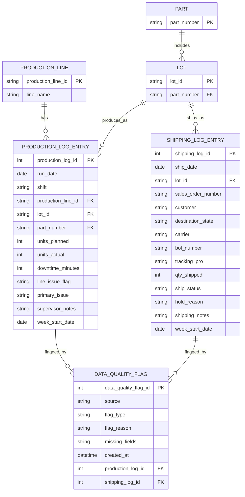

# Data Entities & Relationships (Ops Only: Production + Shipping Logs)

This model is derived **only** from the Operations user story + Part A logic, using the two Ops spreadsheets:

- **Ops_Production_Log**
- **Ops_Shipping_Log**

The core join key across both logs is **Lot ID**. Weekly reporting is supported via a derived **week_start_date** from each record’s date.

---

## Entities

## 1) ProductionLine

Represents a production line referenced in the production log.

**Attributes**

- `production_line_id` (PK)
- `line_name` (e.g., "Line 1", "Line 3")

---

## 2) Part

Represents the product/part being produced.

**Attributes**

- `part_number` (PK)

---

## 3) Lot

Represents a Lot ID used to connect production records to shipping records.

**Attributes**

- `lot_id` (PK)
- `part_number` (FK → Part.part_number)

---

## 4) ProductionLogEntry

Represents one row from **Ops_Production_Log**.

**Attributes**

- `production_log_id` (PK)
- `run_date`
- `shift`
- `production_line_id` (FK → ProductionLine.production_line_id)
- `lot_id` (FK → Lot.lot_id)
- `part_number` (FK → Part.part_number)
- `units_planned`
- `units_actual`
- `downtime_minutes`
- `line_issue_flag` (e.g., Yes/No)
- `primary_issue` (free-text issue category)
- `supervisor_notes`
- `week_start_date` _(derived from run_date for weekly grouping)_

---

## 5) ShippingLogEntry

Represents one row from **Ops_Shipping_Log**.

**Attributes**

- `shipping_log_id` (PK)
- `ship_date`
- `lot_id` (FK → Lot.lot_id)
- `sales_order_number`
- `customer`
- `destination_state`
- `carrier`
- `bol_number`
- `tracking_pro`
- `qty_shipped`
- `ship_status`
- `hold_reason` (free-text issue category)
- `shipping_notes`
- `week_start_date` _(derived from ship_date for weekly grouping)_

---

## 6) DataQualityFlag

Captures records that should not be counted for summaries due to missing/invalid required fields (e.g., missing Lot ID).

**Attributes**

- `data_quality_flag_id` (PK)
- `source` (PRODUCTION | SHIPPING)
- `flag_type` (e.g., INVALID_LOT_ID, INSUFFICIENT_DATA)
- `flag_reason` (plain English)
- `missing_fields` (optional text list)
- `created_at`
- `production_log_id` (nullable FK → ProductionLogEntry.production_log_id)
- `shipping_log_id` (nullable FK → ShippingLogEntry.shipping_log_id)

---

# Relationships

- **ProductionLine 1 → many ProductionLogEntry**
- **Part 1 → many Lot**
- **Lot 1 → many ProductionLogEntry**
- **Lot 1 → many ShippingLogEntry**
- **ProductionLogEntry 1 → many DataQualityFlag** (optional)
- **ShippingLogEntry 1 → many DataQualityFlag** (optional)

---

# Mermaid ERD (mermaid.js)

